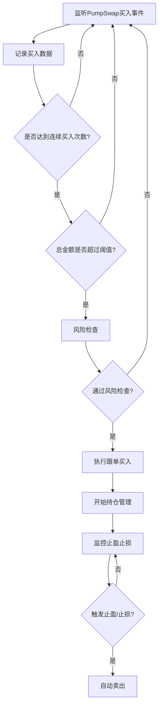

# Solana DEX 连续买入跟单机器人

专业的 Solana PumpSwap 交易机器人，基于连续买入模式识别和跟单策略。当检测到某个代币连续大额买入时，自动跟单买入并进行止盈止损管理。

## ✨ 核心特性

- **🎯 智能跟单**: 检测连续买入模式，自动跟单交易
- **📊 实时监控**: 毫秒级延迟监听链上 PumpSwap 交易事件
- **💰 自动止盈止损**: 15% 止盈，10% 止损，全自动执行
- **🛡️ 风险管理**: 多重风险控制，保护资金安全
- **⚙️ 灵活配置**: 所有参数可通过环境变量自定义
- **📈 实时统计**: 持仓跟踪、盈亏统计、性能分析

## 🚀 快速开始

### 环境要求

- Node.js 16.0+
- NPM 7.0+
- Solana 交易代理服务正在运行

### 安装依赖

```bash
# 克隆项目后进入目录
cd trading-bot-ts

# 安装依赖
npm install
```

### 配置策略参数

```bash
# 复制配置模板
cp .env.example .env

# 编辑配置文件
nano .env  # 或使用其他编辑器
```

### 核心配置说明

#### 🔗 服务连接
```env
HTTP_API_URL=http://localhost:3000     # 交易代理 HTTP API
WS_URL=ws://127.0.0.1:9001            # WebSocket 数据流
REQUEST_TIMEOUT=30000                  # 请求超时 (毫秒)
```

#### 📈 交易策略
```env
CONSECUTIVE_BUYS=3                     # 连续买入次数检测
TOTAL_AMOUNT_THRESHOLD=5.0             # 总金额阈值 (SOL)
TIME_WINDOW_MINUTES=5                  # 时间窗口 (分钟)
BUY_AMOUNT_SOL=0.01                   # 跟单买入金额 (SOL)
```

#### 💰 止盈止损
```env
TAKE_PROFIT_PERCENT=15.0              # 止盈百分比
STOP_LOSS_PERCENT=-10.0               # 止损百分比
CHECK_INTERVAL_SECONDS=10             # 检查间隔 (秒)
```

#### 🛡️ 风险控制
```env
MAX_POSITIONS=5                        # 最大同时持仓数
COOLDOWN_MINUTES=5                     # 代币冷却时间 (分钟)
SLIPPAGE_BPS=500                      # 滑点保护 (5%)
```

## 🎯 运行机器人

### 启动交易机器人

```bash
# 开发模式 (实时日志)
npm run bot

# 生产模式 (编译后运行)
npm run bot:prod

# 构建项目
npm run build

# 仅监听事件 (不执行交易)
npm run subscribe
```

### 启动输出示例

```
🚀 启动交易机器人...
✅ 服务器状态: healthy
🚀 交易机器人已连接到数据流
📡 正在监听链上交易事件...
📊 当前状态: 0 个持仓, 总投资 0 SOL

📊 分析买入事件: A1B2C3D4... Amount: 2.5000 SOL
📊 分析买入事件: A1B2C3D4... Amount: 1.8000 SOL
📊 分析买入事件: A1B2C3D4... Amount: 3.2000 SOL

🎯 检测到连续买入模式!
   代币: A1B2C3D4E5F6G7H8...
   连续买入: 3次
   总金额: 7.5000 SOL
🚀 执行跟单买入!
   我们买入: 0.01 SOL
✅ 买入成功: 5YoP8xT2M...
📊 当前状态: 1 个持仓, 总投资 0.01 SOL

📈 A1B2C3D4... PnL: +12.50%
🎯 触发止盈: 16.20% >= 15.00%
✅ 止盈成功: 3KpL9vN8Q...
   盈亏: +16.20% (+0.00162 SOL)
```

## 💡 使用方式

### 🤖 自动交易模式 (推荐)

```typescript
import { TradingBot } from 'trading-proxy-client';

const bot = new TradingBot();
await bot.start();

// 机器人自动执行：
// ✅ 监听 PumpSwap 买入事件
// ✅ 检测连续买入模式
// ✅ 自动跟单买入
// ✅ 实时止盈止损管理
// ✅ 风险控制和仓位管理
```

### 📊 仅数据监控

```typescript
import { EventSubscriber } from 'trading-proxy-client';

const subscriber = new EventSubscriber();

subscriber.on('pumpswap', (event, latency) => {
  const action = event.is_buy ? '🟢 BUY' : '🔴 SELL';
  console.log(`${action} ${event.mint} ${latency?.latency_ms}ms`);
});

subscriber.connect();
```

### 🔧 手动交易

```typescript
import { TradingProxyClient } from 'trading-proxy-client';

const client = new TradingProxyClient();

// 健康检查
const health = await client.health();

// 手动买入
const result = await client.buy(dexParams, {
  mint: 'token_address',
  amount_sol: 0.01,
  slippage_bps: 500
});
```

## 🧠 策略详解

### 连续买入跟单策略

机器人采用智能的连续买入模式识别策略，通过检测短时间内的大额买入行为来发现潜在的交易机会。

#### 📊 工作原理

```
时间轴: 00:00 ────────────► 00:05 ────────────► 00:10

代币 ABC:
├─ 00:01  🟢 买入 2.5 SOL  (用户A)
├─ 00:02  🟢 买入 1.8 SOL  (用户B)
├─ 00:03  🟢 买入 3.2 SOL  (用户C)
└─ 00:04  🎯 触发跟单！总计 7.5 SOL > 5.0 SOL 阈值
```

#### 🎯 触发条件 (全部满足)

1. **连续买入检测**: 在时间窗口内检测到连续买入
2. **金额阈值**: 累计买入金额达到设定阈值
3. **时间限制**: 所有买入发生在指定时间窗口内
4. **风险检查**: 通过持仓限制、冷却时间等风险控制

#### ⚡ 执行流程



#### 💰 止盈止损机制

- **实时监控**: 每10秒检查一次持仓收益
- **止盈触发**: 达到15%收益时自动卖出
- **止损保护**: 亏损达到10%时自动止损
- **精确计算**: 基于买入价格实时计算收益率

#### 🛡️ 多重风险控制

1. **持仓限制**: 最多同时持有5个代币仓位
2. **冷却机制**: 同一代币5分钟内只能买入一次
3. **滑点保护**: 交易时设置5%滑点保护
4. **金额控制**: 固定小额买入，控制单笔风险
5. **时间窗口**: 限制在短时间窗口内的买入行为

## 📈 性能特性

### ⚡ 低延迟优势

- **毫秒级响应**: WebSocket实时数据流，延迟<100ms
- **高效处理**: 异步事件处理，不阻塞主线程
- **智能缓存**: 价格历史缓存，快速计算收益

### 🔄 自动化管理

- **无人值守**: 7x24小时自动运行
- **自动清理**: 定期清理过期数据，保持性能
- **异常恢复**: 网络断线自动重连，容错性强

### 📊 实时统计

```typescript
// 获取实时统计
const stats = bot.getStats();
console.log(`
持仓数量: ${stats.totalPositions}
总投资: ${stats.totalInvested} SOL
总盈亏: ${stats.totalPnL} SOL
平均收益: ${stats.avgPnL.toFixed(2)}%
`);
```

## ⚠️ 注意事项

### 💡 使用建议

1. **测试先行**: 建议先在小金额下测试策略效果
2. **参数调优**: 根据市场情况调整连续买入阈值
3. **风险意识**: 设置合理的持仓上限和买入金额
4. **网络稳定**: 确保网络连接稳定，避免错过交易机会

### 🚨 风险提示

- 加密货币交易具有高风险，可能导致本金损失
- 机器人交易无法保证盈利，请理性投资
- 建议设置合理的资金上限，控制整体风险
- 定期监控机器人运行状态，及时处理异常

### 🔧 故障排除

#### 常见问题

**Q: 机器人无法连接到服务器**
```bash
# 检查服务器状态
curl http://localhost:3000/health

# 检查WebSocket连接
wscat -c ws://127.0.0.1:9001
```

**Q: 交易执行失败**
- 检查钱包余额是否充足
- 验证滑点设置是否合理
- 确认代理服务正常运行

**Q: 未检测到买入机会**
- 降低 `TOTAL_AMOUNT_THRESHOLD` 阈值
- 增加 `TIME_WINDOW_MINUTES` 时间窗口
- 检查 WebSocket 连接是否正常

## 📚 API 文档

### TradingBot 类

```typescript
class TradingBot {
  constructor()                        // 创建机器人实例
  async start(): Promise<void>         // 启动机器人
  stop(): void                        // 停止机器人
  getPositions(): Map<string, Position> // 获取当前持仓
  getStats(): Stats                   // 获取统计信息
}
```

### 事件监听

```typescript
bot.on('buy-success', (data) => {
  // 买入成功事件
});

bot.on('sell-success', (data) => {
  // 卖出成功事件
});

bot.on('error', (error) => {
  // 错误事件处理
});
```

## License

MIT
